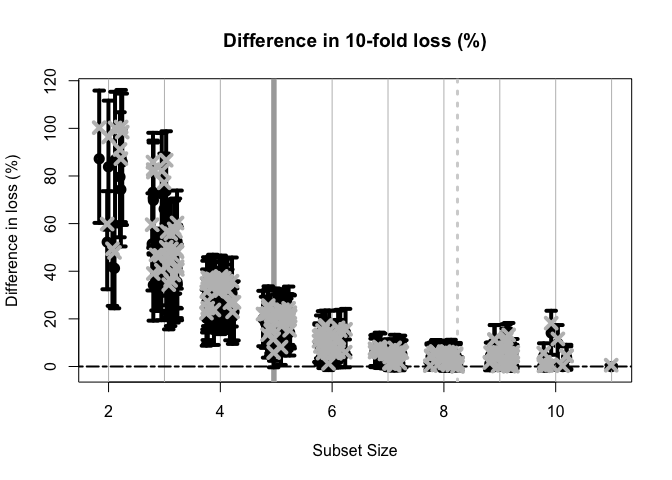
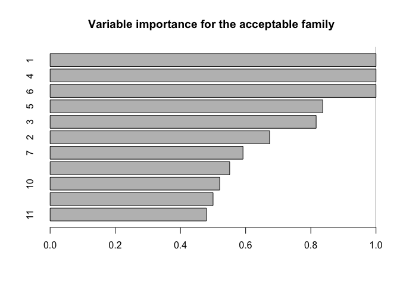
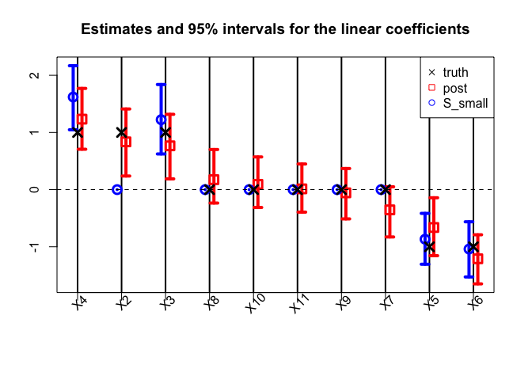

<!-- README.md is generated from README.Rmd. Please edit that file -->

# BayesSubsets

<!-- badges: start -->
<!-- badges: end -->

`BayesSubsets` provides **Bayesian subset selection** for a variety of
Bayesian regression models. These include:

- Bayesian regression of $y \in \mathbb{R}$ or $y \in \{0,1\}$ on
  ($n \times p$) covariates $X$ [(Kowal,
  2022a)](https://jmlr.org/papers/v23/21-0403.html)

- Targeted prediction for $h(\tilde{y})$, where $h$ is a known
  functional that describes a key outcome of interest (e.g., $y$ is
  continuous, and $h$ is an indicator for exceedance of a threshold);
  multiple functionals can be considered for a single model [(Kowal,
  2021)](https://doi.org/10.1080/01621459.2021.1891926)

- Bayesian linear mixed models that regress $Y$ ($m \times n$) on $X$,
  where we observe $m$ repeated measurements for each subject
  $i=1,\ldots,n$ [(Kowal, 2022b)](https://doi.org/10.1111/biom.13707).

These specific cases are explored in the vignettes.

For *any* Bayesian regression model $M$, `BayesSubsets` provides:

1.  Optimal **linear** coefficients (with uncertainty quantification)
    for a *given* subset of covariates;

2.  The **acceptable family** of subsets that are *near-optimal* linear
    predictors relative to the “best” subset (according to
    cross-validation);

3.  The **smallest acceptable subset**, which prioritizes parsimony
    while maintaining predictive accuracy; and

4.  The **variable importance** for the acceptable family, which
    provides variable-specific summaries of these near-optimal subsets.

The smallest acceptable subset is a reasonable default choice for subset
selection. However, we caution against the overreliance on any single
subset without compelling motivation. A key contribution of the
acceptable family is that it identifies *many* competing explanations
(subsets) that are nearly indistinguishable in predictive accuracy. From
a purely predictive perspective, we cannot completely rule out any
member of the acceptable family. As such, we recommend including the
*variable importance* metric to summarize the many near-optimal linear
predictors.

## Installation

You can install the development version of `BayesSubsets` from
[GitHub](https://github.com/) with:

``` r
# install.packages("devtools")
devtools::install_github("drkowal/BayesSubsets")
```

## Example use

To illustrate the use of `BayesSubsets`, we present an example with
simulated data and a Bayesian linear model. The vignettes explore this
and other cases in more detail.

First, load the package:

``` r
library(BayesSubsets)
```

Then simulate data:

``` r
# To reproduce:
set.seed(123) 

# Simulate some data:
dat = simulate_lm(n = 200,   # number of observations
                  p = 10,    # number of predictors
                  p_sig = 5, # number of true signals
                  SNR = 1    # signal-to-noise ratio
)

# Store the data:
y = dat$y; X = dat$X
```

Next, we fit a Bayesian linear model. The output from `bayeslm` does not
include posterior predictive draws or log-predictive density
evaluations, so we compute those as well.

``` r
# Package for efficient Bayesian linear regression:
library(bayeslm)

# Fit the Bayesian regression model:
fit = bayeslm(y ~ X[,-1], # intercept already included
              N = 10000, # MCMC samples to save
              burnin = 5000 # initial samples to discard
)
#> horseshoe prior 
#> fixed running time 0.000791292
#> sampling time 0.105118

# Extract the posterior predictive draws and lpd:
temp = post_predict(post_y_hat = tcrossprod(fit$beta, X),
                    post_sigma = fit$sigma,
                    yy = y)
post_y_pred = temp$post_y_pred
post_lpd = temp$post_lpd
```

Using the model output, we enumerate a collection of “candidate
subsets”. For small $p$ it may be possible to include all possible
subsets. Here, we screen to the “best” `n_best = 50` models of each size
according to squared error loss. We store these in a Boolean matrix
`indicators`: each row is an individual subset, while the columns
indicate which variables are included (`TRUE`) or excluded (`FALSE`).

``` r
indicators = branch_and_bound(yy = fitted(fit), # response is the fitted values
                             XX = X,            # covariates
                             n_best = 50        # restrict to the "best" 50 subsets of each size
)

# Inspect:
indicators[1:5, 1:10]
#>            X1    X2    X3    X4    X5    X6    X7    X8    X9   X10
#> force_in TRUE FALSE FALSE FALSE FALSE FALSE FALSE FALSE FALSE FALSE
#>          TRUE  TRUE FALSE FALSE FALSE FALSE FALSE FALSE FALSE FALSE
#>          TRUE FALSE FALSE  TRUE FALSE FALSE FALSE FALSE FALSE FALSE
#>          TRUE FALSE  TRUE FALSE FALSE FALSE FALSE FALSE FALSE FALSE
#>          TRUE FALSE FALSE FALSE FALSE FALSE FALSE FALSE  TRUE FALSE

# Dimensions:
dim(indicators)
#> [1] 362  11

# Summarize the model sizes:
table(rowSums(indicators)) # note: intercept always included
#> 
#>  1  2  3  4  5  6  7  8  9 10 11 
#>  1 10 45 50 50 50 50 50 45 10  1
```

From this collection of 362 candidate subsets, we seek to filter to the
**acceptable family** of subsets, i.e., those “near-optimal” subsets
that predict about as well as the “best” subset. These are computed
based on 10-fold cross-validation, and use the out-of-sample predictive
distribution from $M$ to provide uncertainty quantification for
predictive accuracy.

``` r
# Compute the acceptable family:
accept_info = accept_family(post_y_pred = post_y_pred,
                            post_lpd = post_lpd,
                            XX = X,
                            indicators = indicators,
                            yy = y,
                            post_y_hat = tcrossprod(fit$beta, X))
```



``` r

# How many subsets are in the acceptable family?
length(accept_info$all_accept)
#> [1] 103

# These are the rows of `indicators` that belong to the acceptable family:
head(accept_info$all_accept)
#> [1] 107 157 158 159 160 161

# An example acceptable subset:
ex_accept = accept_info$all_accept[1]
which(indicators[ex_accept,])
#> X1 X3 X4 X5 X6 
#>  1  3  4  5  6
```

The plot shows how the out-of-sample predictive performance varies
across subsets of different sizes, specifically relative (% change) to
the “best” subset (by minimum cross-validated error; dashed gray
vertical line). The x-marks are the (usual) empirical cross-validated
error, while the intervals leverage the predictive distribution from $M$
to quantify uncertainty in the out-of-sample predictive performance.
While performance improves as variables are added, it is clear that
several smaller subsets are highly competitive—especially when
accounting for the predictive uncertainty.

If we wish to **select** a single subset, a compelling representative of
the acceptable family is the **smallest** acceptable subset. This choice
favors parsimony, while its membership in the acceptable family implies
that it meets a high standard for predictive accuracy. From the previous
plot, we select the smallest subset for which the intervals include zero
(solid gray vertical line).

``` r
# Simplest acceptable subset:
beta_hat_small = accept_info$beta_hat_small

# Which coefficients are nonzero:
S_small = which(beta_hat_small != 0)

# How many coefficients are nonzero:
length(S_small)
#> [1] 5
```

The “best” subset by minimum cross-validation often includes many
extraneous variables, which is a well-known (and undesirable) byproduct
of cross-validation.

``` r
# Acceptable subset that minimizes CV error:
beta_hat_min = accept_info$beta_hat_min

# Typically much larger (and often too large...)
sum(beta_hat_min != 0)
#> [1] 8
```

For reference, the true model size is 6.

Returning to the *smallest* acceptable subset, we can obtain posterior
samples and credible intervals for the coefficients as before:

``` r
# Draws from the posterior predictive distribution
post_beta_small = proj_posterior(post_y_pred = post_y_pred,
                                 XX = X,
                                 sub_x = S_small)

# Compute 95% credible intervals for the nonzero entries:
t(apply(post_beta_small[,S_small], 2, 
        quantile, c(0.05/2, 1 - 0.05/2)))
#>          2.5%      97.5%
#> X1 -1.6918273 -0.8464020
#> X3  0.6238419  1.8385971
#> X4  1.0472439  2.1673297
#> X5 -1.3055990 -0.4155887
#> X6 -1.5278812 -0.5626135
```

Another useful summary of the acceptable family is the **variable
importance**, which reports, for each variable $j$, the proportion of
acceptable subsets in which $j$ appears. We are particularly interested
in distinguishing among those variables that occur in *all*, *some*, or
*no* acceptable subsets, which provides insight about which variables
are indispensable (“keystone covariates”) and which variables are part
of a “predictively plausible” explanation.

``` r
# Variable importance: proportion of *acceptable subsets* in which each variable appears
vi_e = var_imp(indicators = indicators,
               all_accept = accept_info$all_accept)$vi_inc

# "Keystone covariates" that appear in *all* acceptable families:
which(vi_e == 1)
#> 1 4 6 
#> 1 4 6

# Irrelevant covariates that appear in *no* acceptable families:
which(vi_e == 0) 
#> named integer(0)

# Visualize:
barplot(vi_e[order(vi_e, (ncol(X):1))], # order...
        horiz = TRUE, 
        main = paste('Variable importance for the acceptable family'))
abline(v = 1)
```



Each variable appears in quite a few acceptable subsets, which is
unsurprising: the covariates are moderately correlated, so it is
reasonable to expect that some are roughly interchangeable in terms of
predictive accuracy.

Finally, we compare the point and interval summaries from the smallest
acceptable subset to the traditional point and interval summaries from
the Bayesian linear model: the posterior mean and 95% credible intervals
for $\beta$.



The traditional model summaries are completely dense: the point
estimates $\hat{\beta}$ are nonzero for *all* covariates. By comparison,
the point estimates from the smallest acceptable subset are sparse, with
only 5 active coefficients. Both sets of posterior summaries track the
true coefficients reasonably well.

Additional documentation and examples are available at
<https://drkowal.github.io/BayesSubsets/>.
